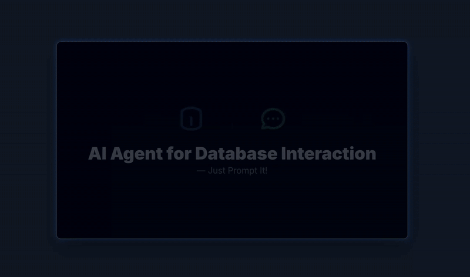
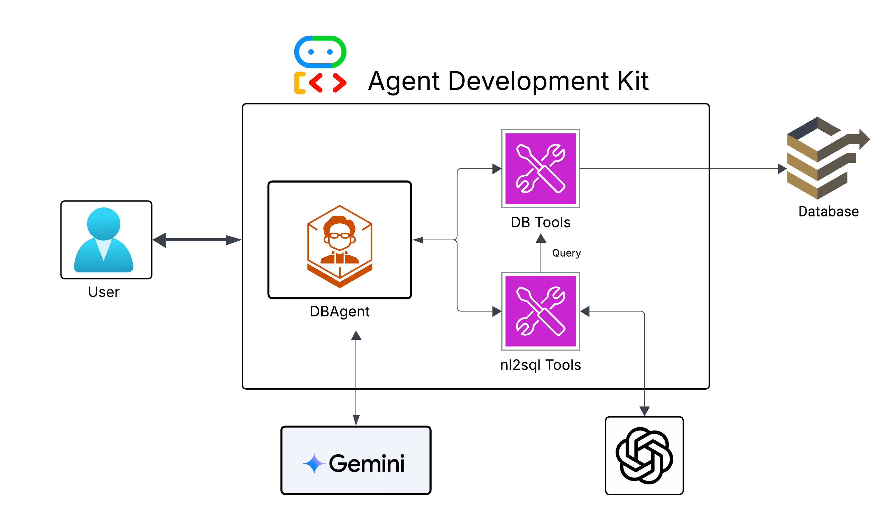
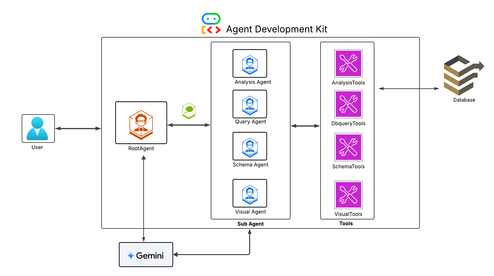

# 🤖 DB Agent - Conversational Database Assistant

Welcome to the DB Agent, a powerful conversational AI interface that allows you to interact with your PostgreSQL database using natural language queries. This project demonstrates how to build intelligent agents that bridge the gap between human language and complex database operations.

---

## 🎥 Demo Video

## 🧰 Project Structure

This repository contains two primary implementations:

- **Single-Agent DB Agent**: A straightforward implementation where a single agent handles all tasks.
- **Multi-Agent DB Agent**: A more advanced architecture where a root agent delegates tasks to specialized sub-agents.

---

## 🧠 Architecture Diagrams

### 🧩 Single-Agent Architecture

In this setup, a single agent interprets the user's input and calls appropriate tools directly.

---

### 🧪 Multi-Agent Architecture

In this setup, a RootAgent delegates tasks to specialized sub-agents (e.g., QueryAgent, SchemaAgent, etc.) for modular and scalable execution.

---

## 🔧 What is the Agent Development Kit (ADK)?

The **Agent Development Kit (ADK)** by Google is a framework designed to build smart, modular, and reliable AI agents powered by Large Language Models (LLMs) like Gemini.

### ✨ Key Advantages of ADK:
- **Abstracts LLM Logic**: No need to manage prompting, orchestration, or loops.
- **Modular Tooling**: Tools are simple Python functions—clean and reusable.
- **Intelligent Reasoning**: LLMs decide which tool to invoke based on intent.
- **Deployment-Ready**: Local or production deployment made easy.

---

## 🧠 General Architecture Overview

### Workflow:
1. **User Interaction**: User asks a question in plain language.
2. **LLM Interpretation**: Agent uses Gemini (or another LLM) to understand the intent.
3. **Tool Invocation**: The agent chooses and runs an appropriate tool (e.g., `run_query`, `convert_to_sql`).
4. **Database Interaction**: The tool connects to PostgreSQL using `psycopg2` and executes SQL.
5. **Response Generation**: Results are translated into human-readable responses.

### Multi-Agent Setup:
- **RootAgent**: Handles high-level delegation.
- **QueryAgent / SchemaAgent / AnalysisAgent**: Specialized sub-agents execute focused tasks.

---

## 🚀 Use Cases

DB Agents can transform how teams interact with data. Example use cases include:

- **SQL-less Business Intelligence**: Empower non-technical users to query data using natural language.
- **Conversational Database Bots**: Integrate with Slack or dashboards to answer data queries.
- **Automated Reporting & Dashboards**: Automatically generate visualizations or reports.
- **Rapid Data Exploration**: Help data teams inspect schemas and perform analysis quickly.

---

## 📂 Getting Started

To dive in, refer to the individual README files in each directory:

- [`single-agent/README.md`](./db_agent/DB_Agent_Single_Agent_README.md)
- [`multi-agent/README.md`](./db_multi_agent/DB_Agent_Multi_Agent_README.md)

---

## 🛠 Technologies Used
- Python
- PostgreSQL
- psycopg2
- Google ADK
- Gemini / LLMs

---

## 📄 License

MIT License © 2025
